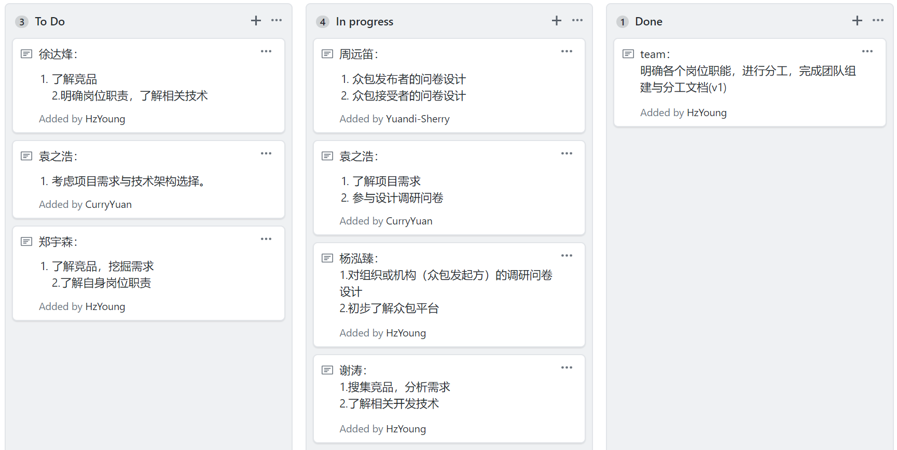
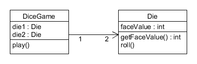

# Homework 2

## 1.简答题

- 用简短的语言给出对分析、设计的理解。

  分析：将复杂的事物逐渐进行拆分，最终理解事物的本质，得到最终的需求。

  设计：根据需求对软件的结构、功能进行整体规划，形成具体的解决方案来满足需求。

- 用一句话描述面向对象的分析与设计的优势。

  面向对象的的设计方式更接近人类的自然思维方式，设计出来的对象结构比较稳定，支持封装、抽象、继承和多态，提高了软件的可重用性、可维护性和可扩展性。

- 简述 UML（统一建模语言）的作用。考试考哪些图？
  - UML采用图形化的表现形式，产生的模型易于理解，易于开发人员与用户之间的沟通，从而能够及时得到用户的反馈信息。
  - 用UML进行系统建模得到的建模制品不仅仅包含各种模型框图，还有大量丰富的文档，这些文档给系统后期的维护工作带来了便捷。
  - 用UML作为编程语言，使用UML完成软件系统的执行规范，可运行的代码就能够被自动生成。
  - 用UML敏捷建模，与草图的功能类似，通过建立UML顺序图，能够提高开发的质量和速度。
  - 考试要考：用例图，静态图、行为图，实现图

- 从软件本质的角度，解释软件范围（需求）控制的可行性

  软件的本质决定了软件开发的困难，Brook 总结其本质特性为四个：复杂性、一致性、可变性和不可视性。

  项目的首要约束是工期、范围、质量和预算四个基本元素。一个项目合约，即是关于四个元素在理论上精确的约定。项目管理的任务就是优化调度资源使得这些约束得以满足，且最低的成本。

  范围，在多数情况下，客户与开发者能就项目的 20% 内容给出严格的需求约定，80% 的内容都是相对模糊的。因此，围绕客户目标，发现并满足客户感兴趣的内容是最关键的。以 Office 产品为例，早期的版本的功能没有现在版本的 1% ，但这并不会妨碍它的成功。在当年并没人预见到 Office 会有如此多功能，使用者也不会因罗列诸多功能的产品感兴趣，感兴趣的往往是当时背景下最能创造价值的几个特性。

  由于软件本身的复杂性、不可见性、不一致性、可变性，软件范围多数情况下对于客户和开发者都是模糊的，这形成软件产品与其他产品不同的开发过程。因此，范围管理是软件项目管理的重中之重！
  
  软件工程语录：“先做到，再做好！”。砍去一些客户都没思考清晰的业务，永远是对的。
  
## 2. 项目管理实践
#### 看板使用练习

#### UML绘图工具练习
P7 图1-5 局部设计类图

  